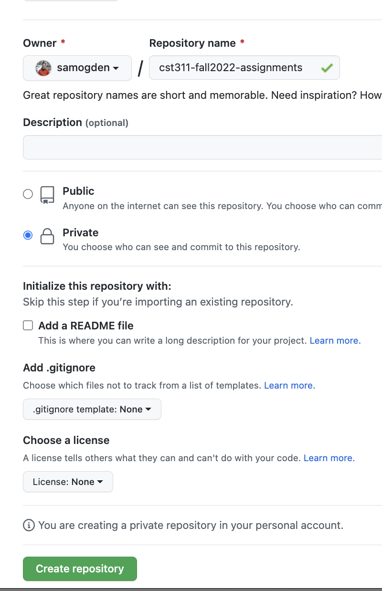
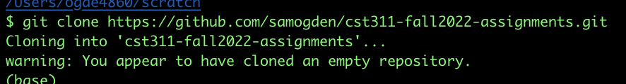
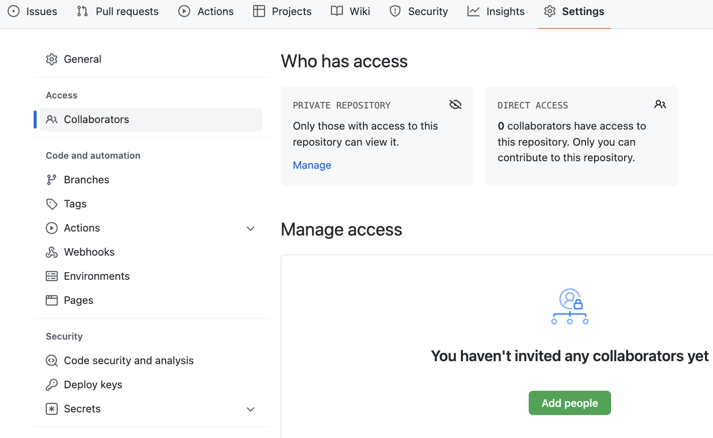

# Setting Up a Private Fork of a Repository

## Background 


By default, github doesn't allow you to set up private forks of repositories.  
Therefore, to ensure that only you and your team can access your repository and thus your code, you have to take a few extra steps to set up your copy of the code, while still ensuring you can get updates if we make any.

These steps will only need to be taken by one person on your team and then you can all share this as your common repository.

## How to set up your own private repository

The overall steps are we are setting up an empty private repository and then setting it to use this repository as a remote.
We are using a variation of the steps found [here](https://deanmalone.net/post/how-to-fork-your-own-repo-on-github/).

### Step 1: Set up your own repository and mark it as private

Start setting up a new repository via [this link](https://github.com/new).
Give it a descriptive name with the format of `cst311-[semester]-[teamname]` and make sure to mark it as a "private" repository.  Below I use `cst311-fall2022-assignments` as my repo name, but you should change what you name yours.
This ensures that the only people who can see it are those who you can add -- specifically your teammates. 



After you fill in this information click "Create repository" and your repository will be created.
Note, we want this to be an empty repository so we can add other files to it later.

### Step 2: Clone your new repo to your local machine

Next, clone your empty repository to your local machine.
It will warn you that you are cloning an empty repository, which is to be expected.



Once you have created your new repository change to the directory with the command `cd [repository name]`.  
For my example repository this would be `cd cst311-fall2022-assignments`.

### Step 3: Add a new upstream

Add this repository as an "upstream" to your new repository.
You do this with the following command:

```shell
git remote add upstream https://github.com/samogden/CST311online-assignments.git
# Note: this command may need to be modified if you are currently looking at a different repo than the above.
```


This will add this repository as an "upstream", which allows it to pull updates as well as the initial data, which we will do in a moment.

### Step 4: Pull from the upstream

Run the following command to pull from the upstream.

```shell
$ git pull upstream main
remote: Enumerating objects: 83, done.
remote: Counting objects: 100% (83/83), done.
remote: Compressing objects: 100% (58/58), done.
remote: Total 83 (delta 19), reused 70 (delta 15), pack-reused 0
Unpacking objects: 100% (83/83), 542.80 KiB | 769.00 KiB/s, done.
From https://github.com/samogden/CST311online-assignments
 * branch            main       -> FETCH_HEAD
 * [new branch]      main       -> upstream/main
```

### Step 5: Push to your github repo

Push your newly downloaded files to your remote repository.
Note, this command may run into issues if your remote repository has the main branch set as `master` instead of `main`, but this can be changed in github.

```shell
$ git push origin main
Enumerating objects: 83, done.
Counting objects: 100% (83/83), done.
Delta compression using up to 8 threads
Compressing objects: 100% (73/73), done.
Writing objects: 100% (83/83), 542.31 KiB | 12.33 MiB/s, done.
Total 83 (delta 19), reused 0 (delta 0), pack-reused 0
remote: Resolving deltas: 100% (19/19), done.
To https://github.com/samogden/cst311-fall2022-assignments.git
 * [new branch]      main -> main
```

### Step 6: Add your teammates to your repository

Add your teammates as collaborators in your github repo.  This is under Settings -> Collaborators.



